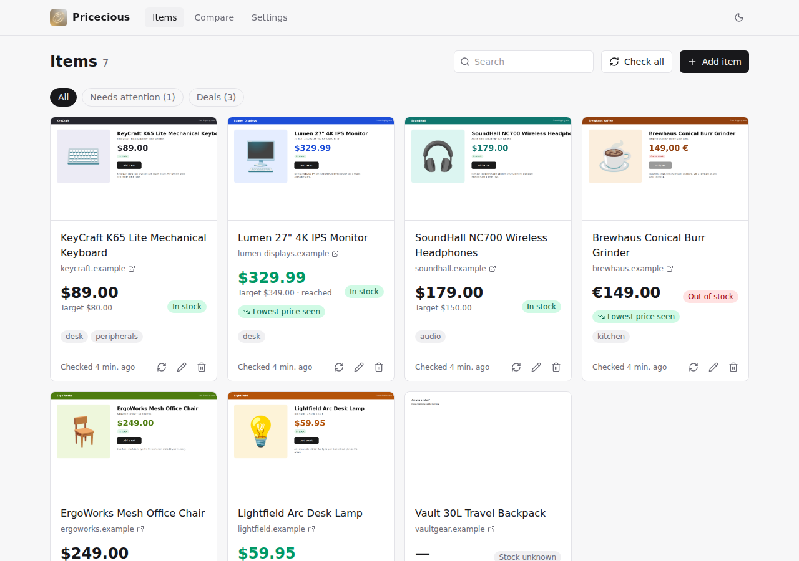
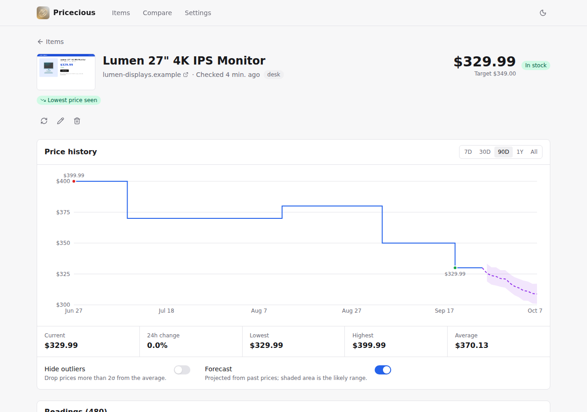
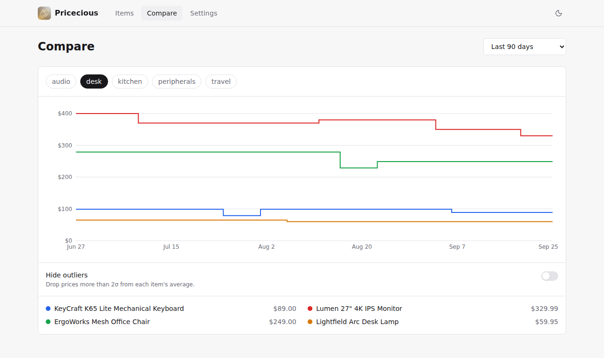

<p align="center">
  
</p>

<h1 align="center">(My) Pricecious</h1>

<p align="center">
  Price tracking using A-Eyes 🤦
</p>

> [!WARNING]
> This is 100% vibe-coded.

**Pricecious** is a self-hosted price tracker. It opens product pages in a headless browser, takes a screenshot, and
asks a vision model (Ollama, OpenAI, Anthropic, Gemini or OpenRouter) for the price and stock status. It keeps the
history, charts it, forecasts it with Prophet, and notifies you through [Apprise](https://github.com/caronc/apprise)
when prices drop, hit your target, or items come back in stock.

<picture>
  <source media="(prefers-color-scheme: dark)" srcset="docs/screenshots/items-dark.png">
  
</picture>

## Quick start

You need Docker, and either an API key for a hosted model or a local Ollama with a vision model (e.g. `gemma3:4b`).

1. Save this as `docker-compose.yml`:

    ```yaml
    services:
      app:
        image: ghcr.io/ds-sebastian/pricecious:latest
        container_name: pricecious-app
        ports:
          - "127.0.0.1:8000:8000"
        environment:
          - DATABASE_URL=postgresql://user:password@db:5432/pricewatch
          - BROWSERLESS_URL=ws://browserless:3000
        depends_on:
          - db
          - browserless
        extra_hosts:
          - "host.docker.internal:host-gateway"
        volumes:
          - screenshots_data:/app/screenshots

      db:
        image: postgres:15-alpine
        environment:
          POSTGRES_USER: user
          POSTGRES_PASSWORD: password
          POSTGRES_DB: pricewatch
        volumes:
          - postgres_data:/var/lib/postgresql/data

      browserless:
        image: browserless/chrome:latest
        expose:
          - "3000"
        environment:
          - MAX_CONCURRENT_SESSIONS=10

    volumes:
      postgres_data:
      screenshots_data:
    ```

2. Run `docker compose up -d` and open http://localhost:8000.
3. In **Settings**, pick your AI provider and model, then add items from the **Items** page.

## Keep it private

Pricecious has no user authentication. Anyone who can reach it can change settings and trigger AI-backed checks, so keep
it on a trusted LAN/VPN and never publish port 8000 directly to the unrestricted Internet.

When a reverse proxy shares the Docker network, replace the app's `ports` entry with `expose` so only the proxy can reach
it:

```yaml
services:
  app:
    expose:
      - "8000"
    networks:
      - default
      - proxy

networks:
  proxy:
    external: true
```

Restrict the proxy to your actual LAN or VPN subnet. For example, an Nginx deployment could use:

```nginx
location / {
    allow 192.168.1.0/24; # Replace with your LAN subnet
    allow 100.64.0.0/10;  # Tailscale address range; remove if unused
    deny all;
    proxy_pass http://pricecious-app:8000;
    proxy_set_header Host $host;
    proxy_set_header X-Forwarded-Proto $scheme;
}
```

For direct LAN access, change the app mapping to `8000:8000` and restrict it at the host firewall, for example:

```bash
sudo ufw allow from 192.168.1.0/24 to any port 8000 proto tcp
```

These ranges are examples only; narrow them to the networks you control. Browser cross-origin checks are additional
drive-by protection, not a substitute for the firewall or proxy allowlist.

## Using it

- **Items**: add a product page; the name, if you leave it out, and the currency come from the page on the first
  check, which starts right away. Each card shows the latest price, stock status, a badge when the price is the
  lowest seen (or the lowest in 90 days), and what went wrong if a check failed. When a page lists a range across
  options, the price is the cheapest option and the top of the range is shown under it. A sale badge shows the
  store's own promotion label and the discount from the crossed-out price. That's the store's claim; the green
  "lowest" badges come from your own history, so seeing both is a good sign the sale is real. The **Needs attention** and
  **Deals** filters gather those up. Click a screenshot to see what the browser saw.
- **Bookmarklet**: the Add item dialog has a **+ Pricecious** link. Drag it to your bookmarks bar, then click it on
  any product page to add that page.
- **Item page**: price history with lowest/highest markers, out-of-stock periods shaded, an optional forecast, and
  every reading. Filter readings by price, stock or confidence to find bad ones, tick them (or every match, across
  pages) and delete them or set the right price in one go; the current price follows the newest reading. Corrected
  readings count as confirmed, so "lowest price" deals and alerts use them.
- **Compare**: items that share a tag (e.g. `gpu`) on one chart.
- **Check all** checks every item that wasn't checked in the last 5 minutes, so repeated clicks don't run up your AI
  bill. The check button on a single item always runs.
- **Settings**: AI model, confidence thresholds, price sanity limits, browser behaviour, schedules and notification
  profiles.

<picture>
  <source media="(prefers-color-scheme: dark)" srcset="docs/screenshots/item-dark.png">
  
</picture>

<picture>
  <source media="(prefers-color-scheme: dark)" srcset="docs/screenshots/compare-dark.png">
  
</picture>

### When the AI gets it wrong

Use **Test** in Settings → AI model to run your settings, saved or not, on one of your items and see the model's
answer and raw reply. It's the quickest way to check a new model, key or base URL.

Signup and cookie popups are closed (or hidden) before the screenshot, and the AI is told to read the product behind
anything left over, so they rarely need attention.

- Add **Instructions for the AI** to the item (Edit → Advanced), e.g. "Use the price of the 2 TB model." This is also
  how to track one option of a product whose page shows a price range.
- Set a **Price element** CSS selector so the right part of the page is on screen.
- Turn on **Send page text to the AI** in Settings for pages where the price is small or hard to read.
- Raise **Minimum price confidence**. Readings below it are recorded but don't change the price.
- Turn on **Reject sudden price jumps** to ignore misreads such as a price picked up from another product.

### Keeping AI costs down

Every check visits the page, but the AI is only asked when the page's prices or stock wording ("add to cart", "sold
out", ...) differ from the last AI check, and at least once a day. Price changes on unrelated parts of the page just
mean the AI is asked, so nothing is missed; with a CSS selector set, only that element's price counts. "Check now"
always asks the AI. Settings shows how many checks didn't need it. The biggest lever is still the check interval:
calls per day are roughly items × 24 ÷ hours between checks.

Checks run on the item's own interval, else its notification profile's, else the global default. An item that fails
repeatedly (20 times by default) is paused until you turn its scheduled checks back on.

## Configuration

AI, scraper and schedule settings live in the Settings page. The container reads these environment variables:

| Variable | Description | Default |
| :--- | :--- | :--- |
| `DATABASE_URL` | PostgreSQL connection string (required). | |
| `BROWSERLESS_URL` | WebSocket URL of Browserless, or of any Chrome with remote debugging. | `ws://browserless:3000` |
| `BROWSERLESS_TOKEN` | Browserless token. | |
| `BROWSERLESS_BLOCK_ADS` | Ask Browserless to block ads. | `false` |
| `BROWSERLESS_STEALTH` | Browserless stealth mode. | `false` |
| `BROWSERLESS_HEADLESS` | Headless mode passed to Browserless, e.g. `new`. | |
| `BROWSERLESS_VIEWPORT_WIDTH` / `_HEIGHT` | Browser viewport in pixels. | |
| `SCREENSHOT_DIR` | Where screenshots are kept. | `screenshots` |
| `CORS_ORIGINS` | Extra trusted browser origins, comma separated. Same-origin requests need no entry. | |
| `LOG_LEVEL` | Log level. | `INFO` |

The Browserless options are sent as query parameters, so you don't have to escape JSON in a URL yourself. LiteLLM's
own environment variables (such as `OPENAI_API_KEY`) also work when no API key is set in Settings.

The scraper only visits addresses that resolve to public IPs, including redirects, subresources and WebSockets. Still
run Browserless behind an egress firewall that blocks private, loopback, link-local and metadata addresses.

### Notifications

Create a notification profile in Settings with an [Apprise URL](https://github.com/caronc/apprise/wiki), for example
`discord://webhook_id/webhook_token` or `ntfys://ntfy.sh/your-topic`, then choose it on each item. A profile can alert
on price drops, reaching the target price, a new lowest price (after two weeks of history) and stock changes.

## Development

```bash
uv sync                                   # Python 3.12 and dev tools
uv run pytest                             # backend tests (SQLite)
uv run ruff check . && uv run ruff format .
cd frontend && npm install && npm run dev # UI on :5173, proxies /api to :8000
npm run check                             # Biome lint + format check
```

Run the backend with `DATABASE_URL=... uv run alembic upgrade head && uv run granian --interface asgi app.main:app`.
Set `TEST_POSTGRES_URL` to a disposable database to also test the migrations.

## License

GNU General Public License v3.0; see [LICENSE](LICENSE).
